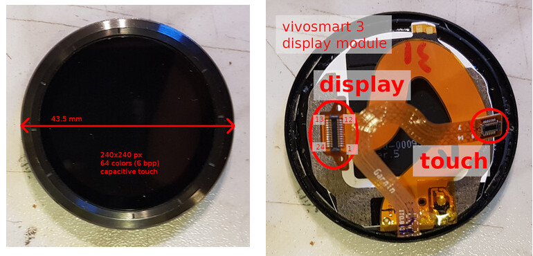
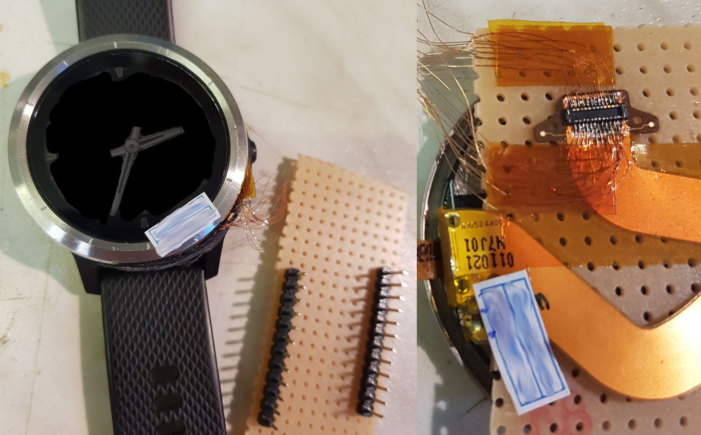

# TL;DR: Garmin Vivosmart 3 LCD Display driver

Bit-banging LCD display driver in Python for the Garmin Vivosmart 3 LCD. 
This is a proof-of-concept for the pyboard v1.1 which has an STM32 
without FSMC. Hence, it uses bit-banging to drive the display.

## Usage

* Wire up the LCD to the pyboard v1.1 I/O pins as shown in `lcd_v3.py`.
* Compile micropython with littlevgl bindings: [lv_micropython](https://github.com/littlevgl/lv_micropython). Ideally, freeze `lcd_v3.py` into micropython to save RAM usage (see below).
* Flash the pyboard with the newly built micropython using `dfu-util`.
* Place the files `lv_v3.py`, `boot.py`, `main.py` on the pyboard attached as a USB disk.

## Freezing the LCD driver into micropython

Freeze the bit-banging driver into micropython to reduce the RAM usage:

* copy `lcd_v3.py` to `ports/stm32/modules/lcd_v3.py` in the `lv_micropython` folder
* in `ports/stm32/boards/manifest.py`, add:
    `freeze('$(MPY_DIR)/ports/stm32/modules', 'lcd_v3.py')`

or look up usage of `FROZEN_DIR` make variable.

For the pyboard v1.1, I then built micropython in `lv_micropython` ([github](https://github.com/littlevgl/lv_micropython)) using:
`make -C ports/stm32 LV_CFLAGS="-DLV_COLOR_DEPTH=8" BOARD=PYBV11 all`

Then I flashed the board, bridging BOOT0 to 3V3 with a jumper, resetting the board and using:
`dfu-util --alt 0 -D ports/stm32/build-PYBV11/firmware.dfu`

# Battle story: Reverse-engineering a Vivosmart 3 LCD Display

For a custom smartwatch device, I needed a round LCD display with a touchscreen. Shopping around a little bit on AliExpress and Banggood, the options seemed limited to rectangular displays with an aspect ratio that would leave most of the watch's front unused - and no touch screen. Then, I stumbled upon a replacement display module for the Garmin Vivosmart 3. Needless to say, this module came without a datasheet.

Most of the inspiration for this project came from https://www.youtube.com/watch?v=7TedIzmguP0 - if you are serious about reverse-engineering a display interface, you should definitely watch this.

## Test wiring

To measure how the display is controlled, I purchased a used Garmin Vivosmart 3 smartwatch from ebay. I opened it using some hot air (the display module is glued on), then attached 0.15 mm wires to the display data connector. I had some fun soldering those! For future reference, the connector is 0.4 mm pitched, and the Hirose receptacle `BM20B(0.6)-24DS-0.4V(53)` **almost** fits it (but it is slightly too narrow). It would be possible to order a header/receptacle pair, and replace the header on the display's FPC...

## Initial measurements

First, I measured the voltage on the pins using a DMM, and then moved on to an oscilloscope to check for higher-frequency components.

There is a Garmin app (Connect IQ) that allows a paired smartphone to upload watch face images. I uploaded some line patterns to the watch, and could verify the pattern changing on the data pins.

Label | Pin | Pin | Label
-------- | -------- | -------- | -----
1.04 V floating | 12 | 13 | 3.2 V
1.04 V floating | 11 | 14 | 0.23 V floating
200 µs end pulse | 10 | 15 | 5 V
100 µs period rect: row | 9 | 16 | 100 µs begin pulse
chip select | 8 | 17 | 50 µs period rect: 40% duty cycle
60 Hz rect | 7 | 18 | 60 Hz rect, opposite phase to pin 7
GND | 6 | 19 | 3.2 V
1.2 MHz clock | 5 | 20 | hairpin impulses every 50 µs
data | 4 | 21 | data
data | 3 | 22 | data
data | 2 | 23 | data
60 Hz rect, in phase with pin 18 | 1 | 24 | hairpin impulses every 50 µs

## Decoding data bits

Using a digital storage oscilloscope, I recorded the data pins as the display is updated. Then, I transferred those recordings to my computer, and started decoding the data.

* I uploaded test patterns to the watch screen using Garmin Connect IQ and measured signals until I had the pixel layout on the wire. During this, I wrote a Python script decoding the recorded oscilloscope data.
* Later, I wrote a second Python script generating the pixel layout from an image buffer, and verified that I could decode it with the first script.
* Finally, I re-wrote the second Python script for Micropython.
